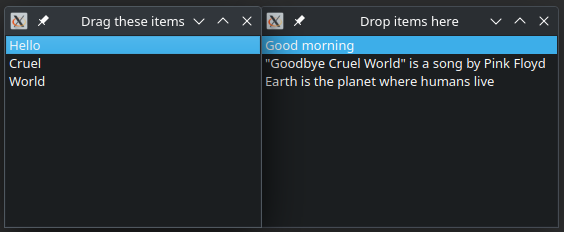

# Simple Drag and Drop Item Model

Simple Drag and Drop Item Model based on the Qt documentation:

https://doc.qt.io/qt-6/model-view-programming.html#using-drag-and-drop-with-item-views

There are two instances of DragDropItemModel (which is a subclass of QStandardItemModel),
one for the left list view (the origin of drag-and-drop) and another one for the right 
list view (the destination of the drag-and-drop operations).

Each item on the left list view has two data roles (strings):
* Qt::DisplayRole (the displayed item)
* Qt::UserRole (the data that is drag-and-dropped)

That is why the strings displayed on the first list view are not the same as the the ones
displayed on the right list view.

Copyright (c) 2023, Pedro López-Cabanillas

SPDX-License-Identifier: BSD-3-Clause
